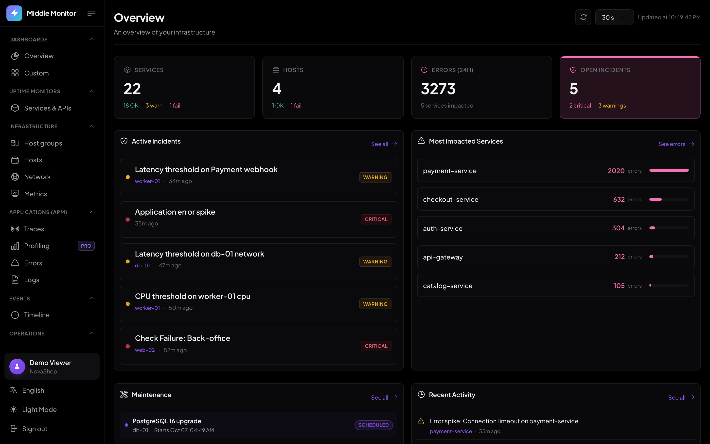
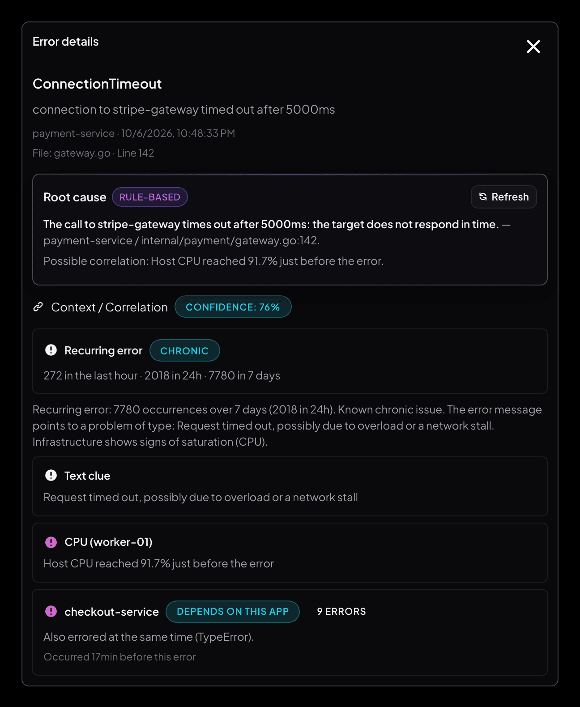
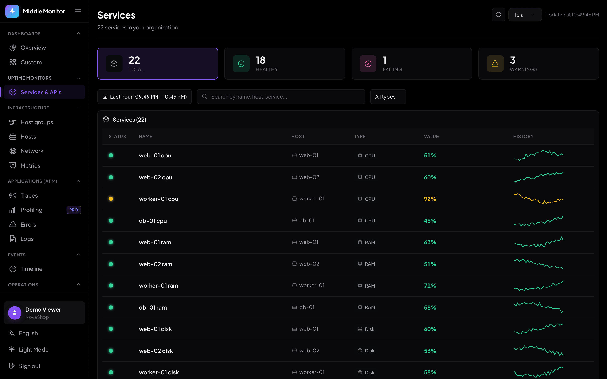

<p align="center">
  
</p>

<h1 align="center">Middle Monitor</h1>

<p align="center">
  When something breaks, you get the cause. Not five dashboards to cross-check.
</p>

<p align="center">
  <a href="https://github.com/middle-monitor/middle-monitor/actions/workflows/ci.yml"></a>
  <a href="LICENSE.md"></a>
  <a href="https://github.com/middle-monitor/middle-monitor/tags"></a>
  <a href="https://github.com/middle-monitor/middle-monitor/stargazers"></a>
</p>

<p align="center">
  <a href="https://middlemonitor.io/demo"><b>Live demo</b></a> (no sign-up) ·
  <a href="https://middlemonitor.io/docs">Docs</a> ·
  <a href="#self-hosting">Self-hosting</a> ·
  <a href="https://middlemonitor.io">Website</a>
</p>



Uptime checks, host metrics, application errors, traces, logs and profiles in
one place, with alerts that explain what probably went wrong. This repository is
the full product: run it yourself, or use the hosted version at
[middlemonitor.io](https://middlemonitor.io).

## What it does

- **Checks**: HTTP, ping, SQL, TLS certificates and SNMP, run on a schedule from the backend.
- **Hosts**: a small agent reports CPU, memory, disk and network, and can scrape
  Prometheus endpoints (static, Nomad or DNS SRV discovery).
- **Applications**: SDKs (or any OTLP exporter) send errors, traces, logs and Go profiles.
- **Alerts and incidents**: threshold rules, maintenance windows, notifications by email,
  Slack, webhook, WhatsApp and Jira Service Management.
- **Root cause**: each failure is correlated with what happened around it (host
  saturation, neighbouring services, traffic spikes) and summarized in one sentence.
  Rules-based by default; can use any OpenAI-compatible model.
- **Status page**: a public uptime page for the instance (`SELF_MONITOR_ORG_SLUG`).

<p align="center">
  
</p>

How it compares with Datadog, Sentry, New Relic, Grafana, Nagios, Pingdom and others:
[middlemonitor.io/alternatives](https://middlemonitor.io/alternatives).

## Self-hosting



Requires Docker with Compose and about 3 GB of RAM (OpenSearch is the largest part).

```bash
git clone https://github.com/middle-monitor/middle-monitor.git
cd middle-monitor/deploy/self-hosted
cp .env.example .env   # fill in JWT_SECRET, DB_PASSWORD and SEED_ADMIN_*
docker compose up -d
```

Prebuilt images (amd64 and arm64) are pulled from `ghcr.io/middle-monitor`;
`MM_VERSION` in `.env` pins a release, and `docker compose up -d --build` builds
from your checkout instead.

Open <http://localhost:8000> and sign in with the `SEED_ADMIN_*` account. Without
SMTP configured, signups cannot confirm their email, so the seeded admin is the
way in; invite the rest of the team once SMTP is set.

Billing is off unless `BILLING_ENABLED=true`: every organization is unlimited,
and per-organization caps or retention can be set from the platform admin page
(`PLATFORM_ADMIN_EMAILS`).

## Architecture

```text
agents, SDKs, OTLP ──> receiver ──> Kafka ──> worker ──> PostgreSQL / OpenSearch
browser ──> frontend (React) ──> api ──────────────────> PostgreSQL / OpenSearch
```

| Directory   | Contents |
|-------------|----------|
| `backend/`  | Go services: `api` (dashboard API, migrations), `receiver` (ingestion), `worker` (checks, alerting, retention), `payments` (Stripe, hosted only) |
| `frontend/` | React + Vite dashboard, public site and documentation |
| `agent/`    | Host agent, served as binaries by the API |
| `deploy/self-hosted/` | Docker Compose stack with a Caddy entry point |

## SDKs and integrations

Each lives in its own repository:

| SDK | Install |
| --- | --- |
| [Go](https://github.com/middle-monitor/sdk-go) | `go get github.com/middle-monitor/sdk-go` |
| [Node.js / TypeScript](https://github.com/middle-monitor/sdk-typescript) | `npm install @middle-monitor/sdk` |
| [Browser](https://github.com/middle-monitor/sdk-web) | `npm install @middle-monitor/web` |
| [Python](https://github.com/middle-monitor/sdk-python) | `pip install middle-monitor-sdk` |
| [Rust](https://github.com/middle-monitor/sdk-rust) | see the repository README |
| [Terraform provider](https://github.com/middle-monitor/terraform-provider-middmonitor) | `middle-monitor/middmonitor` |

## Development

```bash
# backend (needs PostgreSQL; see backend/README.md)
cd backend && go test ./...

# frontend, proxies /api to localhost:8080
cd frontend && npm ci && npm run dev

# agent
cd agent && go test ./...
```

See [CONTRIBUTING.md](CONTRIBUTING.md) before opening a pull request, and
[SECURITY.md](SECURITY.md) to report a vulnerability.

## License

[FSL-1.1-ALv2](LICENSE.md): you can use, modify and self-host Middle Monitor for
any purpose except offering it as a competing commercial service. Each release
becomes Apache 2.0 two years after it is published. The SDKs and the Terraform
provider are under their own permissive licenses.
